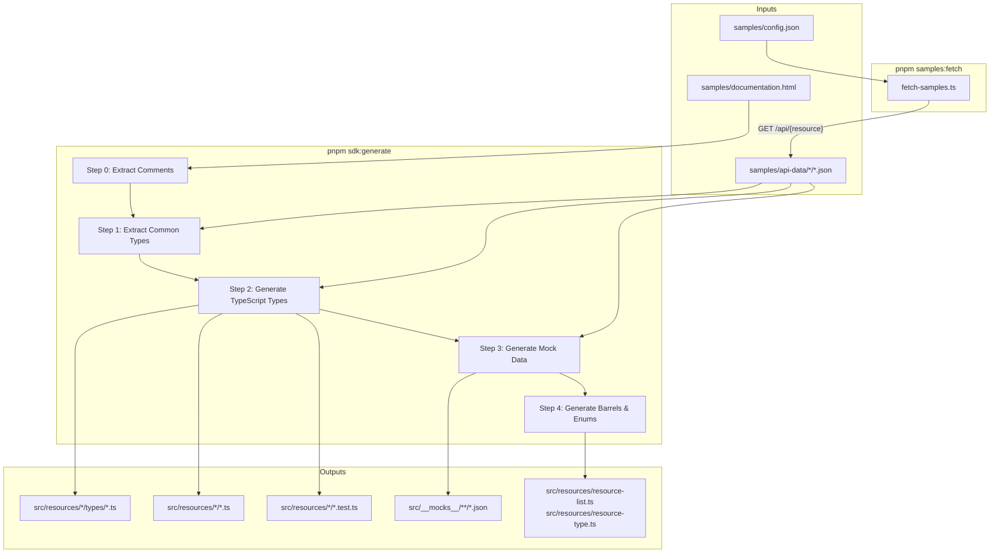

# Code Generation

The SDK's TypeScript types, resource classes, tests, and mock data are all generated from sample Comic Vine API responses. This ensures type definitions stay accurate and consistent with the real API.

## Pipeline Overview



## Type Inference Pipeline

Each resource's types go through a multi-stage transformation:


| Stage | Module | Purpose |
| --- | --- | --- |
| Infer | `sample-inferrer.ts` | Analyse sample JSON to determine property types, nullability, arrays, nested objects, and enums |
| Comments | `comment-injector.ts` | Inject JSDoc descriptions parsed from `documentation.html` |
| Common types | `common-types-generator.ts` | Replace recurring object shapes (Image, ApiResource, SiteResource, etc.) with shared type imports |
| Overrides | `type-overrides.ts` | Apply manual fixes for properties where sample data is ambiguous |
| Emit | `type-emitter.ts` | Walk the type graph and emit TypeScript source with imports, interfaces, and enums |

## Scripts

### `pnpm samples:fetch`

Fetches fresh API responses from Comic Vine. Requires the `COMIC_VINE_API_KEY` environment variable.

- Reads resource URLs from `samples/config.json`
- Rate-limits to 3 requests/second
- Saves responses to `samples/api-data/{resource-folder}/`

### `pnpm sdk:generate`

Runs the full generation pipeline (`generate-sdk.ts`):

**Step 0 &mdash; Extract comments:** Parses `documentation.html` with cheerio to extract property descriptions, writes `samples/code-comments/comments.json`.

**Step 1 &mdash; Extract common types:** Scans all flattened sample responses to identify recurring object shapes that match known common types (ApiResource, SiteResource, Image, Death, etc.).

**Step 2 &mdash; Generate TypeScript types:** For each of the 38 resource folders (19 details + 19 list items), runs the inference pipeline above and writes type files. For detail resources, also generates the resource class, test file, and barrel exports.

**Step 3 &mdash; Generate mock data:** Takes the first sample from each resource folder, writes a snake_case version to `src/__mocks__/api-response/` and a camelCase-transformed version to `src/__mocks__/expected-responses/`. Issue list resources get additional pagination variants.

**Step 4 &mdash; Generate barrels & enums:** Creates `resource-list.ts` (re-exports all resource classes) and `resource-type.ts` (ResourceType enum with Comic Vine API type IDs).

## Generator Modules

All modules in `generate-sdk/` are **pure functions** &mdash; they take input and return strings or objects. The orchestrator (`generate-sdk.ts`) handles all file I/O.

| Module | Responsibility |
| --- | --- |
| `sample-inferrer.ts` | Infers `InferredTypeGraph` from sample JSON (types, nullability, arrays, enums, index signatures) |
| `type-emitter.ts` | Walks type graph and emits TypeScript source with imports, interfaces, and enums |
| `comment-injector.ts` | Parses API documentation HTML and injects JSDoc descriptions into type graphs |
| `common-types-generator.ts` | Detects and replaces nested types matching shared shapes with common type imports |
| `type-overrides.ts` | Applies known type corrections where sample data is ambiguous |
| `resource-generator.ts` | Generates resource class files extending `BaseResource` |
| `test-generator.ts` | Generates test files that verify correct `resourceType` |
| `mock-data-generator.ts` | Creates snake_case and camelCase test fixtures from sample data |
| `barrel-generator.ts` | Generates index/barrel files and the `ResourceType` enum |

## Sample Data Structure

```
samples/
├── config.json                 # Resource configs with sample URLs
├── documentation.html          # Scraped Comic Vine API docs
├── code-comments/
│   └── comments.json           # Extracted property descriptions (generated)
└── api-data/
    ├── character-details/      # Multiple sample responses per resource
    │   ├── character-4005-1345.json
    │   └── character-4005-1279.json
    ├── character-list-item/
    │   └── characters.json
    └── ...                     # 38 folders (19 resources x 2)
```

## Idempotency

Running `pnpm sdk:generate && pnpm format` should produce zero `git diff` on `src/`. If it doesn't, either the samples have changed or a generator module has been modified.
